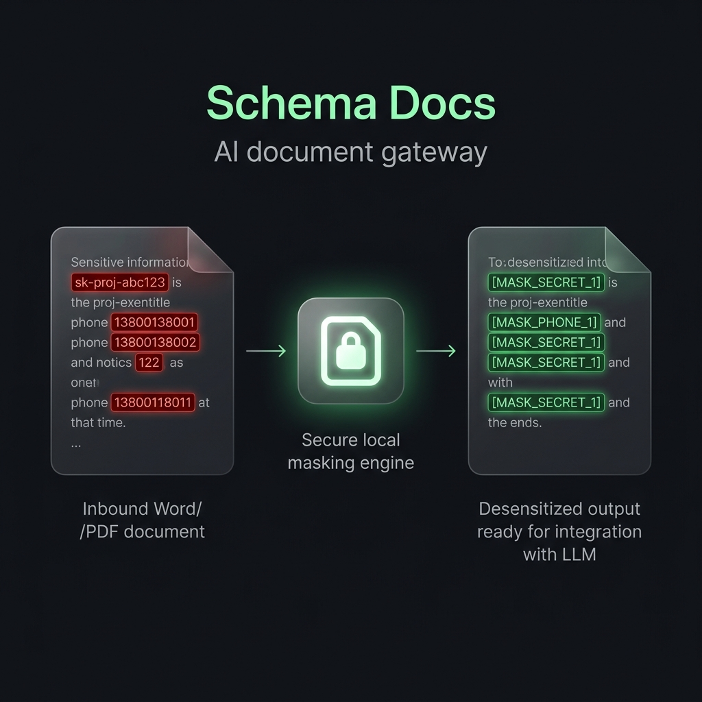

# Schema Docs (v0.1.1)

[Website](http://schemadocs.org/) | [Repository](https://github.com/schema-sandbox/schema-docs)

> **Local-first document conversion and AI intake for very large, difficult files. Before sending a document to AI, see what AI will see. Do not send raw files directly to AI.**
>
> Import Word, PDF, Excel, CSV, or Markdown; mask PII locally; trim the context; block unsafe sends; and export a verifiable SDXP exchange package.

[](#testing)
[](#license)
[](#installation)
[](#changelog)

Schema Docs is for people who already feed documents into ChatGPT, Claude, Gemini, or private LLM workflows and want a safer intake layer before any content leaves the machine. It is not trying to replace Office; it protects the moment before a document becomes AI context.

Drop in a Word doc, PDF, Excel spreadsheet, CSV, or Markdown file. Schema Docs converts it locally into auditable Markdown, runs privacy masking, lets you preview exactly what would be sent to the AI model, then packages the result as a signed, portable `.exchange` bundle. No cloud upload is required.

## Built for very large documents

Large-document conversion is a core capability, not an edge case. The Windows desktop workflow has been manually verified for intake and segmented editing with individual documents at approximately **5 million Chinese characters** and **3,000+ pages**. Structured Word/HTML export has been exercised on those workflows; the rebuilt styled PDF path is separately regression-tested with a large, formula-heavy CJK document.

Schema Docs segments oversized sources for responsive reading and editing while keeping a full-document export path. This allows book-length manuscripts, archives, research material, and other files that are impractical to paste into ordinary editors or AI chat windows to remain usable as one conversion task.

These figures describe completed real-world tests, not a universal speed guarantee. Processing time depends on hardware and source complexity; scanned PDFs, damaged text layers, complex formulas, tables, and embedded images may require OCR or visual preservation and take longer.

```bash
npm run demo
```

That one command creates a temporary workspace, imports a document with PII and credentials, shows raw versus masked AI context, proves Send Gate blocks the unsafe confirmed send, writes an AI handoff bundle, verifies an SDXP package, and cleans up after itself.



```text
Word / PDF / Excel / CSV
        |
        v
[ Local Extraction ]   -> zero dependencies, runs offline
        |
        v
[ Privacy Masking ]    -> detect PII, API keys, credentials
        |
        v
[ AI Will See Panel ]  -> preview the exact context before sending
        |
        v
[ Send Gate Decision ] -> approve, block, or export as .exchange
        |
        v
AI Model  --or--  Exchange Package  --or--  Block (local evidence log)
```

---

## Why Schema Docs?

| Problem | Schema Docs answer |
|---------|-------------------|
| "I don't know what goes to the AI" | **AI Will See panel** shows the exact context before sending |
| "I might leak credentials or PII" | **Local masking gateway** detects secrets; replaces with `[MASK_SECRET_1]` |
| "PDFs don't paste cleanly into AI" | **Local extraction** reconstructs readable text blocks from PDF streams |
| "I can't audit what was sent" | **SHA-256 evidence chain** logs every import, preview, send, and blocked attempt |
| "I need to hand off a document securely" | **SDXP exchange package** bundles Markdown + provenance + trust report |

---

## Key Features

### Office / PDF / Spreadsheet Intake
- Adaptive PDF extraction with text-layer recovery, optional local OCR, traceable formulas, recovered tables, and source-linked visual assets
- DOCX to Markdown (headings, lists, tables)
- XLSX multi-sheet parsing with field inference
- Mixed-script document support tested

### Local Privacy Masking Gateway
- Detects email, phone, IP, API keys, passwords, bearer tokens, credential-like UUIDs
- Session-only restoration map; masking keys are never written to disk
- Configurable via `dlp-rules.json`; add your own regex patterns without code changes
- Configurable secret keywords can be added through `dlp-rules.json` without changing code

### Offline SQL Query Engine
- `SELECT`, `WHERE`, `LIKE`, `GROUP BY` (with `COUNT`/`SUM`/`AVG`/`MIN`/`MAX` aggregates), `ORDER BY`, `LIMIT`, and simple `INNER JOIN` over CSV/XLSX
- Query to trimmed Markdown context to AI Send Gate (no raw table dump; compound `WHERE AND/OR`, subqueries, `HAVING`, and complex joins are unsupported)
- Unicode/CJK column headers supported

### SDXP Exchange Package
- Signed directory bundle: `manifest.json` + `document.md` + `document.schema.json` + `evidence.jsonl` + `receiver-report.md`
- SHA-256 integrity on every file
- `[MASK_*]` placeholder protocol for reversible desensitization
- Receiver trust report: `trusted` / `trusted_with_warnings` / `blocked` verdict

### Desktop App (Windows)
- **Windows public-preview package is available**: NSIS setup (`.exe`) and MSI package (`.msi`) are provided
- Tauri shell launches the local Node.js runtime and web UI automatically
- Diagnostics panel shows runtime health, Node version, and API status
- AI summon shortcut (`Ctrl+Alt+A`) opens the Send Gate within the Schema Docs window
- Clipboard text can be masked locally before AI review; no raw clipboard content is sent automatically
- **Public preview scope**: install behavior, WebView2 compatibility, antivirus/SmartScreen, and real document imports still need broader community testing across additional Windows machines

---

## Installation

### Desktop App (Windows)

Download the latest release installer:

- **NSIS setup**: `schema-docs_0.1.1_x64-setup.exe`
- **MSI package**: `schema-docs_0.1.1_x64_en-US.msi`

The installed application opens directly as a normal Windows desktop app. It does not open a Command Prompt, PowerShell, Node.js, or other code window. `Start-Desktop-Client.bat` is retained only as a developer/test launcher and may display diagnostic output.

> **Beta notice**: WebView2 runtime is required (pre-installed on Windows 11 and recent Windows 10). The desktop build runs `scripts/prepare-release.js` to create the packaged Node runtime resource from the current Node executable; the 81 MB executable is deliberately not stored in Git. The installed app falls back to system Node only if the bundled runtime is missing. Clean-machine installer verification is still required before calling the desktop app polished.
### Developer / CLI (Node.js 22+)

```bash
git clone https://github.com/schema-sandbox/schema-docs.git
cd schema-docs
npm install
npm run serve          # Start the local web UI and API at http://127.0.0.1:4177/
```

No native build step required for the web UI and CLI. The Tauri desktop build requires Rust + `cargo`.

Run the 30-second local demo:

```bash
npm run demo
```

---

## Quick Start

### 1. Open a workspace

```bash
npm run cli -- init ./tmp-workspace
```

Or select a folder in the desktop app or web UI.

### 2. Import a document

```bash
npm run cli -- import ./tmp-workspace ./report.pdf
npm run cli -- import ./tmp-workspace ./data.xlsx
```

### 3. Preview what AI will see

```bash
npm run cli -- ai-context ./tmp-workspace preview doc_xxxx
```

Or click the **AI Will See** button in the web UI.

### 4. Send through the AI Gate (with masking)

```bash
npm run cli -- ai-preview ./tmp-workspace summarize "Summarize this report" --mask
```

### 5. Package for secure handoff

```bash
npm run cli -- exchange-package ./tmp-workspace from-record packages/handoff doc_xxxx
```

---

## Common CLI Commands

```bash
# Health check
npm run doctor

# Import & convert to Markdown
npm run cli -- import <workspace> <file>
npm run cli -- document-to <workspace> <recordId> md outputs/document.md

# AI context preview (plan mode for long documents)
npm run cli -- ai-context ./tmp-workspace plan doc_xxxx --summary
npm run cli -- ai-context ./tmp-workspace range doc_xxxx 1 3 9000 --summary

# AI intake safety boundary: exposes sendAllowedAfterReview, blockingWarnings,
# nextRangeCommand, and progress metadata. Low-quality files or Send Gate-blocked
# content can be previewed locally but cannot be treated as directly sendable.

# Workspace summary
npm run cli -- workspace ./tmp-workspace summary

# Local SQL query
npm run cli -- query-export <workspace> markdown "SELECT * FROM table WHERE col > 5"
npm run cli -- query-ai-handoff <workspace> notes/table-handoff.md "SELECT * FROM table WHERE col > 5"

# Privacy masking
npm run cli -- mask <workspace> "Confidential text with API key sk-abc123"
npm run cli -- unmask <workspace> <masked-text> '<mapping-json>'

# Exchange package
npm run cli -- exchange-package <workspace> from-record <outDir> <recordId>
npm run cli -- exchange-package <workspace> trust-report <packageDir>

# Export formats
npm run cli -- md-to-pdf <workspace> notes/doc.md exports/doc.pdf
npm run cli -- md-to-docx <workspace> notes/doc.md exports/doc.docx
```

---

## Standalone SDK API (Embeddable)

Schema Docs can be embedded directly into any Node.js AI Agent or developer workflow as a library:

```javascript
import {
  maskSensitiveData,
  unmaskSensitiveData,
  createAppService,
  createSchemaDocsLocalClient,
  verifyExchangePackage
} from "ai-document-exchange";

// 1. Reversible Masking (local-only)
const originalText = "API Key: sk-proj-1234567890abcdef for user@domain.com";
const { maskedText, mapping } = maskSensitiveData(originalText);
console.log(maskedText);
// Output: "API Key: [MASK_SECRET_1] for [MASK_EMAIL_1]"

// Restore original content after AI returns responses
const restoredText = unmaskSensitiveData(maskedText, mapping);

// 2. Embedded Workspace Management (import and extract)
const service = createAppService("./my-workspace");
const record = await service.importFile("./contract.docx");
console.log(`Document extracted, ID: ${record.id}`);

// 3. Exchange Package Verification (anti-tamper signature checks)
const verification = await verifyExchangePackage("./my-workspace", "packages/handoff");
if (verification.ok) {
  console.log("Exchange package is authentic and untampered.");
}

// 4. Local HTTP API SDK for desktop or agent integrations
const client = createSchemaDocsLocalClient({
  baseUrl: "http://127.0.0.1:4177",
  workspacePath: "./my-workspace",
  token: process.env.SCHEMA_DOCS_API_TOKEN
});
await client.writePackage("packages/handoff", {
  title: "Reviewed handoff",
  body: "# Reviewed handoff\n\nAI-ready Markdown context."
});
await client.verifyPackage("packages/handoff");
```

---

## Architecture Overview

```text
src/
  cli/                  - CLI commands and preflight scripts
  core/                 - Business logic: extraction, masking, exchange, AI gate
    masking.js          - PII masking engine, configured by dlp-rules.json
    aiContext.js        - AI Will See preview compiler
    exchangePackage.js  - SDXP package builder and trust report
    workspaceManifest.js - Workspace summary compiler
  adapters/             - Format adapters: PDF, DOCX, XLSX, CSV, SQL engine
  server/               - Local HTTP API server
  sdk/                  - Local API client SDK

public/                 - Web UI, vanilla JS ES modules, no bundler
src-tauri/              - Tauri desktop shell, Rust and Cargo
docs/                   - Protocol specs, known limits, release docs
test/                   - 333 automated tests
```
**Zero installed npm runtime dependencies**: the core uses Node.js built-ins plus bundled offline assets. Styled PDF export invokes a locally installed Edge or Chromium renderer.

---

## Testing

```bash
npm test                         # 333 automated tests at the source release audit: 332 pass, 1 manual external-sync scenario skipped
npm run release:public-preview   # One-command public-preview gate and handoff refresh
npm run rc-check                 # Full public-preview RC preflight gate
npm run public-preview-package -- --json  # Public-preview installer handoff report
npm run smoke                    # Core exchange cycle smoke
npm run web-ui-smoke             # Web UI + API health smoke
npm run size-check               # Zero-dependency size audit
npm run language-boundary-check  # English-only release docs check
npm run ui-check                 # DOM integrity + module import check
```

---

## Testing And Preflight

Desktop release labels that must stay aligned across UI and docs:

- Desktop diagnostics
- Run first workflow
- Choose workspace
- Choose local file
- Create temporary workspace
- Create sample Word and import

F-012 closure command:

```bash
npm run desktop-fixture-close -- --record <filled-record.json> --write
```

---

## Security Boundaries

| Boundary | Guarantee |
|----------|-----------|
| Document conversion | Fully local; no network calls |
| Privacy masking | Local regex scan; keys never written to disk |
| AI send | Only confirmed + gate-approved sends reach the network |
| Blocked sends | Recorded as local evidence without storing the raw prompt or API key |
| API keys | Used for confirmed sends only; never persisted in profiles |
| Exchange packages | SHA-256 signed; receiver trust report included |

- **AI intake safety boundary**: `ai-context ... --summary`, `/api/ai/intake-plan`, and the Web/Desktop AI Will See panel expose `sendAllowedAfterReview`, `blockingWarnings`, `nextRangeCommand`, and progress metadata. Low-quality files or Send Gate-blocked content can be previewed locally, but cannot be treated as directly sendable content.

---

## SDXP Protocol

The **Schema Docs Exchange Protocol (SDXP)** defines the `.exchange` directory format: a portable, signed, and auditable Markdown-based document bundle.

See [`docs/sdxp-spec-v1.0.md`](docs/sdxp-spec-v1.0.md) for the full specification, or [`docs/sdxp-primer.md`](docs/sdxp-primer.md) for a one-page introduction.

---

## Known Limits

Documented transparently in [`docs/known-limits.md`](docs/known-limits.md):

- Complex multi-column PDF layouts may produce reordered text blocks
- Scanned (image-only) PDFs require the optional local Tesseract + Poppler OCR path or an upstream searchable PDF; without those tools, Send Gate remains blocked
- XLSX formulas are not evaluated; only raw cell values are extracted
- Complex DOCX styles (SmartArt, embedded objects) are simplified

---

## Contributing

See [`docs/developer-quickstart.md`](docs/developer-quickstart.md) for a 10-minute codebase quickstart. See [`CONTRIBUTING.md`](CONTRIBUTING.md) for dev setup, test conventions, and coding guidelines.

---

## Changelog

See [`docs/v0.1.0-release-notes.md`](docs/v0.1.0-release-notes.md) for the v0.1.0 release summary.

---

## Launch Assets

See [`docs/github-release-draft-v0.1.0.md`](docs/github-release-draft-v0.1.0.md) for release copy, Show HN title options, and tester feedback prompts.

---

## License

MIT. See [LICENSE](LICENSE).
