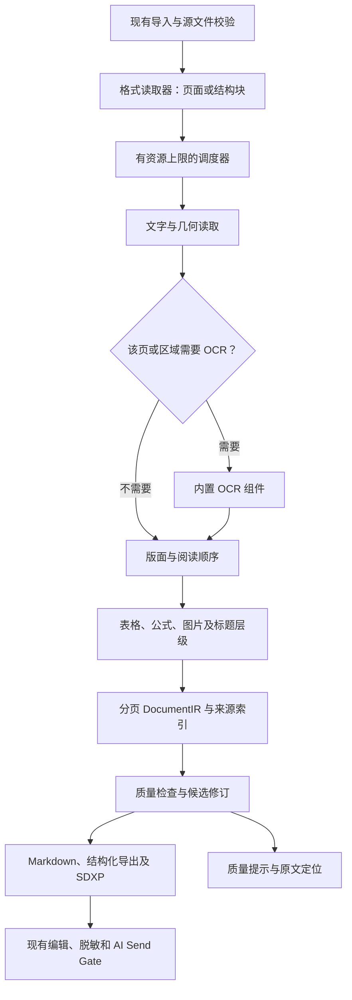

# Schema Docs 文档转换质量构建规划

状态（2026-09-20 目标校正）：以高质量文档转换能力为交付目标，执行决策以第 16 节为准。已有修复及测试结果保留；T01–T08 按完整验收合同逐项关闭，不以局部修复、测试通过数或跑完 G:\\test 推算完成度。详见[执行与测试审计、修正后的修复顺序](execution-audit-2026-09-20.md)。

当前实现边界：本次已把显式 pdfplumber 页面几何路径接入版本化 DocumentIR，并按页/索引落盘；它是带文字层 PDF 的过渡页面后端，不承担扫描识字，也没有宣称已经达到 Docling 的版面识别质量。图像渲染、公式字形恢复、阅读顺序、表格网格和可恢复任务仍需按下述阶段验证。

目标：借鉴 Docling 的文档表示、逐页流水线、结构恢复和质量反馈方法，建设 Schema Docs 自己的转换核心，让复杂文档转换更完整、更准确、更稳定。本文是构建规划；本日执行与测试的专项审计另见上述报告，不代表性能或准确率已经达标。

## 1. 产品约束与关键判断

- 继续提供开源源码和可直接安装的桌面版；仓库现有 MIT 许可证保持原状。
- 用户只需使用 Schema Docs。目标发行版自行携带需要的解析组件，不要求用户安装 Docling、Python 或另一个转换软件。
- 后续在线版按单个文档报价、付款和交付，不做订阅；本地版和在线版复用同一转换核心。
- 保护已完成的公式修复、中文处理、图片导出、大文档分段、编辑保护、路径保护和 Send Gate。每一阶段独立验收、独立回退。
- 本轮先提升已有 PDF、DOCX、XLSX、Markdown 工作流的质量；不以增加格式数量衡量进展。

需要修正前面讨论中的一个预期：借鉴架构并不会自动获得 Docling 的识别质量。其复杂版面和表格能力包含训练后的模型；扫描识字也需要 OCR 引擎。独立实现的是结构恢复、调度、质量决策和产品流程，底层 PDF 解码、字体处理和 OCR 应优先采用可内嵌的成熟组件。[Docling 技术报告，2024 年版本](https://arxiv.org/html/2408.09869v5)

因此，建议把目标表述为“无需用户安装额外依赖、一个安装包、离线可用、依赖可控”。继续坚持所有底层能力都零依赖自研，会显著拖慢复杂 PDF 质量提升。引入内部库和进程是否影响效率，要靠测量；单一软件并不要求所有工作都在同一进程运行。

## 2. 当前基础与实际缺口

以下是从实现直接观察到的事实，风险与预期收益仍需样本验证。

| 当前基础 | 代码位置 | 下一步建设重点 |
| --- | --- | --- |
| PDF 有内置提取、布局、OCR、Marker 等候选路径，并保存尝试记录 | `src/adapters/pdfExtractorPipeline.js` | 从整文档候选切换演进为逐页、逐区域选择；文字可读不能代表内容完整 |
| 内置 PDF 用流解压和 Tj/TJ 指令提取文字，直接组合 Markdown | `src/adapters/pdfMarkdownConverter.js` | 引入真正的页面对象、坐标和字体映射；不能继续靠字符串补丁承担通用 PDF 解析 |
| 已有公式重建、表格恢复、区域坐标和图片兜底 | `src/adapters/pdfLayoutExtractor.py`、`pdfInlineMath.py` | 将这些已有规则及测试转化为新核心的资产，逐项迁移；保留“无法可靠转写时保留原图”的策略 |
| OCR 适配器已经逐页执行，记录失败页并释放临时图片，但结果汇总成整份 Markdown | `src/adapters/pdfOcrExtractor.js` | 保留页级成果，补坐标、选择性 OCR、去重、检查点；避免重做已有页循环 |
| 布局适配器支持页范围，但常规调度仍主要以整份文档为单位 | `src/adapters/pdfLayoutExtractor.js` | 将页范围接口接入统一调度，并让已完成结果可以恢复 |
| 转换入口保护用户修改，也保护指定解析器失败时的旧结果 | `src/core/documents.js` | 新结果先写候选修订，再原子切换；让正文、资产和来源映射属于同一版本 |
| 人类阅读分段按字符和标题；AI 分块按字符预算和重叠 | `src/core/readableMarkdown.js`、`src/core/aiContext.js` | 表格、公式、代码块成为结构单元；阅读分段和 AI 分块共享来源但分别控制大小 |
| 质量报告已有警告、质量状态及 Send Gate 关联；页数目前可由字符数估计 | `src/core/qualityReport.js` | 增加实际页覆盖率、局部失败、对象损失和证据；估计页数不能用于未来收费 |
| Job 有 queued/running/succeeded/failed 和持久化状态 | `src/core/jobs.js` | 状态记录进一步变成可恢复执行：检查点、取消、阶段重试、资源上限 |
| SDXP 已校验 Markdown、schema、evidence、表格和导出哈希 | `src/core/exchangePackage.js` | 新结构数据和来源映射加入版本化清单及校验，不仅写一个未校验的 sidecar |

现有大文档桌面验证可以继续作为回归依据，但不能据此宣称任意 3000 页扫描 PDF 都能稳定转换。`src/cli/large-intake-check.js` 的主体是合成 Markdown 的 AI intake 检查，也不能代替真实 PDF 解析压力测试。

## 3. 从 Docling 吸收什么

| 参考方法 | 在 Schema Docs 中的落实 |
| --- | --- |
| 格式 backend 与处理 pipeline 分离 | 格式读取器输出页面或结构块，调度器只处理统一任务和预算 |
| 文本、表格、图片、层级、版面和来源统一表示 | 设计小规模、版本化的 DocumentIR，不直接复制完整 Docling 类型体系 |
| 分阶段识别与后处理 | 读取 → 内容选择 → 结构恢复 → 文档组装 → 校验 → 导出 |
| 页级处理、有限队列、阶段资源释放 | 页窗口、内存预算、页级落盘、取消和失败隔离 |
| 质量分项与低质量页提示 | 页覆盖、文字、顺序、表格、公式分别报告；保留 unknown 状态 |
| 结构化分块 | 标题路径、表格表头、代码和公式边界随分块保留 |

参考：[架构](https://docling-project.github.io/docling/concepts/architecture/)、[文档表示](https://docling-project.github.io/docling/concepts/docling_document/)、[当前 PDF 流水线源码](https://github.com/docling-project/docling/blob/main/docling/pipeline/standard_pdf_pipeline.py)、[质量报告](https://docling-project.github.io/docling/concepts/confidence_scores/)、[分块](https://docling-project.github.io/docling/concepts/chunking/)。当前 main 分支会变化，开始实现时记录参考 commit。

不把 Docling 作为运行时服务，不整体移植其 Python 框架，不从零训练通用视觉模型。少量确有价值的代码若选择翻译或复用，记录原始版本、文件和许可；不能把逐行翻译当作无需保留来源的独立实现。

## 4. 建议架构



这是逻辑顺序，具体页可重复局部阶段。例如先对扫描页 OCR 后恢复布局；复杂表格可在已有文字坐标基础上做结构识别。每个阶段声明输入、输出、可用能力、版本和成本上限。

核心优先用现有 Node/JS 实现。需要原生 OCR 或渲染时使用随包交付的内部组件；Rust 用于确有价值的原生接口与隔离，不进行全项目语言迁移。桌面仍通过 `appService` 调用，内部 worker 属于同一个产品，用户无需配置独立服务。

## 5. DocumentIR：先保住信息，再决定展示形式

DocumentIR 是内部文档结构，不立即取代对外的 Markdown/SDXP 合同。

最小数据模型：

| 对象 | 必需信息 |
| --- | --- |
| Document | schemaVersion、sourceHash、revisionId、来源类型、引擎/规则/模型版本、页或部分索引 |
| Page/Part | 真实页码或逻辑部分、尺寸/旋转、处理状态、块引用、警告、耗时 |
| Block | id、type、父节点、顺序、文本片段、sourceRefs、处理来源、qualitySignals |
| Table | 单元格行列位置、rowSpan/colSpan、表头、单元格内容、来源、跨页关联 |
| Formula | 原始内容、候选 LaTeX、inline/block、原图引用、恢复状态 |
| Asset | 相对路径、类型、内容哈希、源区域、派生修订 |
| SourceRef | PDF 页/坐标，或 DOCX 部分/段落、XLSX sheet/单元格、PPTX slide/元素 |

具体约束：

- PDF 坐标统一成旋转处理后的左上原点、point 单位，保存原始坐标变换；未知坐标为 null，不能虚构。DOCX/XLSX 不能凭字符数伪造真实页码。
- block type 首轮只涵盖标题、段落、列表、表格、公式、图片、代码、注释、页眉页脚、unknown；先验证再扩展。
- 块 id 在同一源文件及同一处理版本下可复现；不同版本通过显式映射关联，不承诺算法变化后所有 id 永远不变。
- 标注 recovered、visual_preserved、unresolved 等恢复状态。原图保留成功不等于公式已识别成功。
- 原始提取与规范化文本分别保存；不确定的标题、页眉、数学符号不直接删掉。
- 原始 IR 是本地敏感资料，不自动加入 AI 请求、遥测、反馈包或交换包。派生内容和图片沿用现有脱敏、路径检查、发送确认。

大文档存储采用小索引 + 分页/分段文件，例如 `.ai-doc-exchange/cache/documents/<revision>/pages/000001.json`。全量字符对象、图片和 Markdown 不同时驻留内存。PDF 后端自身仍可能保留源字节和字体索引，必须测量，不能声称仅凭分页就实现恒定内存。

## 6. 怎样具体提升识别质量

### 6.1 页面读取和混合文档

原方案优先试验 PDF.js；第 16 节现将首选调整为复用现有 pdfplumber 字符几何与公式能力，以 pypdfium2/PDFium 承担页面渲染，先形成真正的页面后端。PDF.js 保留为该路线出现可复现解码或资源瓶颈时的替换候选，避免在获得能力闭环前同时维护多套新后端。[PDF.js 官方示例](https://mozilla.github.io/pdf.js/examples/)

第一轮试验必须覆盖中文 CMap、字体子集、旋转、裁剪页、损坏文件、真实大 PDF，以及字体/CMap 资源完全离线。文本项不一定细化到每个字形，不能把近似字符框当精确框。Node 无界面渲染所需的 canvas/原生依赖也要实测；WebView 能显示 PDF 不代表 CLI 和云端能完成同样的渲染。

如果后端不能同时满足坐标质量、内存和离线打包目标，就停在选型阶段调整，不在其上堆叠重建算法。现有简易提取器保留兼容用途，升级后不承担高保真模式的默认页面解析。

每页先记录文字覆盖、图像区域、乱码、空白证据和疑似结构。混合 PDF 按页/区域决定 OCR；正常文字页不重识别，扫描附录不因正文可读而遗漏。空白页、装饰图片和真正缺失内容必须分别报告。

### 6.2 阅读顺序与正文

- 用字距、行距、字号、水平重叠和栏间空白恢复行与段落。
- 先确定跨栏标题、栏区域、图注及脚注，再按区域排序；不能简单把全页按 y、x 排序。
- 跨页重复位置和文本作为页眉页脚证据，先归类，导出时决定是否排除；避免删除重复出现的正文。
- 中文换行、英文连字符、列表编号和目录单独处理，迁移现有中文与目录修复用例。
- 无法确定阅读顺序时保留原始对象并提示复核，不以流畅的错误文本掩盖不确定性。

### 6.3 表格、公式和图片

- 表格先恢复单元格网格与跨度，再生成 Markdown。优先处理规则线表格及稳定对齐的无框表格；复杂表头和无框布局不保证纯规则可解。
- 跨页合表依赖列边界、表头和上下文共同证据，不只看“下一页也有表格”。
- 合并单元格在 IR/HTML 中保留；Markdown/CSV 无法完整表达时附结构 JSON 和损失说明，不静默展开成看似正确的数据。
- 公式优先迁移现有字体映射、上下标、积分求和、矩阵和行内数学规则，逐条用现有回归样本验证。语法能渲染不等于数学正确。
- 复杂公式无法可靠重建时保留裁剪原图、位置和状态。后续模型产生的 LaTeX 作为候选，不能无依据覆盖已有正确结果。
- 图像、图注、正文引用关联到同一对象，资产以哈希去重，并保持分段、导出和搬移后的链接有效。

### 6.4 OCR 与模型

先给已用的 Tesseract 路径增加坐标/质量输出与按需调用，再验证将引擎、语言数据和渲染组件内置到发行包。最终面向普通用户的路径不依赖系统 PATH 或另装 Python。[Tesseract 官方项目](https://github.com/tesseract-ocr/tesseract)

若规则路线在复杂布局、无框表格上仍达不到冻结样本目标，再增加单一专用模型候选。可研究 ONNX Runtime 的 Node 接口，但特定模型能否导出、算子是否支持、精度和运行成本都需要验证；不能假设 TableFormer 或任意视觉模型都能直接迁移。[ONNX Runtime Node 文档](https://onnxruntime.ai/docs/get-started/with-javascript/node.html)

同一区域的文字层与 OCR 结果按位置和文本对应关系去重，保留可用原始字形，防止内容重复或更差的 OCR 覆盖正确文字。模型和语言数据随安装包交付的大小、启动及冷加载成本单独列账。第一版不引入通用聊天模型完成全文“润色式转写”。

## 7. 大文档任务与效率

把“转换完后拆 Markdown”进一步扩展为“提取过程就分批完成”：

1. 建立轻量文档索引和每页状态，边处理边生成可查看结果。
2. 用有界页窗口调度；普通文本提取、渲染、OCR 分别限并发和内存。缺省并发从保守值开始，依设备测量调整。
3. 每页或小批次原子落盘，完成后释放位图和临时字体/布局数据；模型会话按 worker 复用。
4. 缓存键包含源文件哈希、阶段/引擎/规则/模型版本、语言、DPI 和影响输出的选项。
5. 取消时停止新任务，并终止/回收执行中的工作；恢复时核验检查点哈希，只重算缺失或无效结果。
6. 跨页表格、目录和标题组装单独运行，读取轻量索引；每个阶段声明跨页依赖，重跑受影响的邻页或文档组装阶段，不能错误复用旧关联。
7. 作业详情记录 missing/failed/review 页。整体完成、带警告完成、部分完成、失败、取消明确区分，避免一页失败重算全书，也避免把部分结果显示为完整成功。
8. 进度按已完成工作单元和当前阶段显示；耗时预估随实际处理修正，不把固定百分比当真实进度。

原子文件写入并不等于并行 read-modify-write 安全。作业细节单独存放，由单一协调器归并状态；工作区 manifest 只记录摘要和引用，避免每一页都并发改写整个 manifest。

## 8. 编辑、分段、导出和兼容

新 IR 的第一版只做提取结果及来源证据。用户已编辑的 Markdown 仍是当前编辑/导出的权威版本；再次提取产生候选修订，不覆盖编辑。

保存 Markdown 后，旧来源映射需要校验修订哈希：能可靠匹配的块保留映射；新增或重排且无法匹配的块标为 user_edit/unmapped。禁止继续展示过期坐标，禁止为了使用新 IR 而丢弃用户编辑。后续可逐步增加块级编辑映射，不在首轮重写编辑器。

分块遵循标题路径和结构块边界：普通表格、公式、围栏代码保持完整；超大表格按行组拆分并重复表头，记录 continuation 引用。单个块超过 AI 预算时明确提示或使用带标记的子块，不能静默截断。token 估计与实际 tokenizer 区分标注。

迁移期间继续通过现有 Markdown 导出器生成 DOCX/HTML/PDF，保护当前公式、中文字体和图片结果。对于 Markdown 表达不了的结构，后续增加局部 IR 导出支持，而非立刻重写全套导出。

SDXP 继续支持旧包。新 IR、来源映射及资产加入清单、大小和内容哈希；新读写器逐项验证，路径仍限制在包内。发布前定义包版本/扩展兼容矩阵：旧包由新读者读取、新包由旧读者读取的实际行为都要验证，不能假设增加一个字段就自然兼容。AI 路径只读取经过现有策略处理的派生内容。

## 9. 如何证明“大步提升”

### 样本与基线

首轮建立 24 份可合法用于测试的真实样本，每类 4 份：普通中英文 PDF、双栏/混合布局、扫描/混合 PDF、复杂表格、数学文档、Office 结构文档。另选至少 3 份真实长文档覆盖 300、1000、3000+ 页；已有大文档与公式修复样本优先进入保护集。

24 份中 16 份用于开发，8 份按类别保留盲测；关键页面进行人工标注，长文档全页检查覆盖并抽样核对正文、结构和末页。现有单元/集成用例另保留，不把旧测试通过数量当新识别质量。

比较三种结果：当前默认路径、当前已配置的增强路径、新路径。记录是否使用 OCR/模型、硬件、缓存冷热、语言、版本和错误，不能用新路径的完整模型与旧路径的纯文本模式得出“算法更强”的结论。Docling 仅可作为可选离线研究对照，不作为测试真值或用户运行依赖。

### 验收指标

下列数值是建议起始门槛，尚未测量；P0 获得基线后冻结，失败时记录原因并重定计划，不事后改口宣传已经达标。

| 维度 | 衡量方法 | 建议首轮门槛 |
| --- | --- | --- |
| 页面完整性 | 源页数对照每页状态；区分空白、失败、提取、原图保留 | 受支持样本每页均有明确处置；不得静默缺页 |
| 文字完整性 | 对人工转录计算遗漏率、重复率和 CER，分别报告数字与扫描页 | 干净文字 PDF CER 不高于 0.5%；保护集无新增明确错字/漏段；其余类别先冻结基线 |
| 阅读顺序 | 人工块顺序中成对先后关系错误率，同时报告漏块率 | 双栏/混排盲测相对当前默认路径错误减少至少 50%，漏块率不增加 |
| 表格 | 对齐后的单元格文本与行列跨度准确率；不只统计识别数量 | 目标类别单元格/结构错误较基线减少至少 30%；无法恢复部分显式报告 |
| 公式保真 | 已确认正确公式、原图保留、未解决分别计数；人工核对语义 | 已修复样本全部保住；每个已知未恢复区域保留来源；不伪报编辑成功 |
| 分块/导出 | 块边界、标题上下文、资产可达、合并单元格损失、全文重组 | 保护集无截断公式/代码和丢失资产；新包哈希可验证 |
| 持久化 | 中断、杀死 worker、重启、缓存损坏、阶段版本变化 | 完成页正确复用；损坏或过期结果不复用；编辑不覆盖 |
| 性能 | 首个可查看页、总耗时、p50/p95、峰值总进程 RSS、磁盘、包体积 | 普通文档相同工作量的 p95 耗时回退不超过 20%；增强模式单独报告质量换取的开销 |

长文档内存建议先在 Windows、16 GB RAM、固定 CPU 上设非模型路径总 RSS 2 GB 目标；若后端或文件特征超过目标，明确记录适用边界并调整方案。它是设计预算，不是已实现上限。扫描/模型路径另定预算，任何路径都必须可取消，不能用“无限大文件”承诺替代资源限制。

质量面板显示“已处理页数 / 原图保留页数 / 未解决页数 / 需要复核的位置”。启发式质量分是风险信号，不能对用户包装成“准确率 99%”；document 平均分也不能盖过少量严重失败页。

## 10. 分阶段构建与交付

| 阶段 | 主要工作与落点 | 阶段可交付结果 | 通过条件 |
| --- | --- | --- | --- |
| P0：质量基线 | 冻结保护集、真实样本、指标、依赖/硬件信息；新增质量评测工具 | 当前不足和目标有可复现实例 | 样本合法可用、标注及盲测分组明确、基线可重复 |
| P1：页面读取与 IR 最小闭环 | 新页面后端、DocumentIR v1、分页落盘；通过 `documents.js` 接入候选修订 | 1 份文字 PDF、1 份混合 PDF 的页数/来源/Markdown 闭环；混合页可明确标识待 OCR | 离线读取通过，页覆盖可核对，旧接口和编辑保护有效；此时不假称扫描页已识别 |
| P2：正文结构质量 | `readingOrder`、标题/列表、重复页眉页脚分类、中英文规则；质量面板第一版 | 双栏论文和长报告正文顺序明显改善，可回到原页复核 | 阅读顺序指标通过，中文/目录保护集通过，普通文档性能预算满足 |
| P3：表格公式与 Office 结构 | 迁移既有数学规则；表格网格/跨度/图注；DOCX 输出 IR，XLSX 保留数据模型 | 表格可核查、公式不丢失、DOCX 合并单元格等结构有依据 | 公式保护集全通过，表格指标改善，图片/导出链接与工作表操作无回归 |
| P4：可恢复大文档任务 | `jobs.js` 摘要接检查点；页窗口、取消、局部重跑、版本缓存与单一协调写入 | 长文档中断后继续，不因一页失败丢弃全部成果 | 真实长 PDF、故障注入、总进程内存和缓存有效性检查通过 |
| P5：内置 OCR 与必要模型 | 打包 OCR/语言数据/渲染组件；区域 OCR 去重；仅按基线结果决定是否增加专用模型 | 普通用户只安装 Schema Docs 就能处理目标扫描文档 | 无 Python/Docling/系统 OCR 环境的干净机器验证；扫描质量、包体积、加载及运行预算通过 |
| P6：结构分块与交付完成 | `readableMarkdown`/`aiContext` 结构分段、编辑映射、SDXP 扩展与导出完善 | 阅读、编辑、AI 输入和交付共用同一可追溯结果 | 全文重组、旧包/新包、脱敏/Send Gate、Windows 安装包相关验证通过 |

依赖顺序为 P0 → P1 → P2 → P3 → P4 → P5 → P6。P1 就实现最基本的有界页窗口、资产释放和修订隔离，避免后面为了性能返工；P4 再完成持久恢复。P2/P3 可以各自发布质量改进，不必等付费网站或所有模型完成。

阶段大小不能仅按文件数估算。P0/P1 后再依据后端、真实扫描质量和打包结果给日期；现在不承诺“几天达到 Docling 全能力”。

## 11. 代码组织建议与第一批任务

以下是规划文件与当前实现状态：

```text
src/core/documentIr.js                  # 已实现：版本化结构、校验与引用约束
src/core/documentIrStore.js             # 已实现：分页 JSON 存储；整套修订原子提交待修复
src/core/conversionPipeline.js          # 阶段调度、资源预算与依赖
src/core/conversionCheckpoint.js        # 已实现：检查点存储及复用判断函数；恢复调度未接入
src/core/conversionQuality.js           # 已实现：页/块信号汇总；真实页覆盖分母待修复
src/core/qualityBaseline.js             # 已实现：无正文质量基线与差异比较
src/core/qualitySampleCatalog.js        # 已实现：合法样本目录元数据读取
src/core/structuredChunker.js           # 已实现：结构分块与来源映射
src/adapters/documentIr.js              # 已实现：非 PDF 逻辑部分适配；复杂图片目标解析待修复
src/adapters/pdfPageReader.js           # 目标页面后端边界；当前过渡实现位于 pdfLayoutExtractor.py
src/adapters/pdfDocumentIr.js            # 已实现：现有 PDF 结果到 DocumentIR 的适配
src/processing/readingOrder.js          # 已实现：几何结构恢复信号
src/processing/pageNoise.js             # 已实现：重复页眉/页脚候选标注，不静默删除正文，并进入文档质量信号
src/processing/headingStructure.js      # 已实现：标题层级、父子关系和标题路径
src/processing/tableStructure.js        # 已实现：Markdown/视觉表格结构信号及单元格源位置映射
src/processing/formulaStructure.js      # 已实现：公式候选与视觉保留状态
src/cli/conversion-quality-check.js     # 已实现：工作区质量报告与严格检查
src/cli/quality-baseline-freeze.js      # 已实现：样本目录关联的基线冻结命令
src/cli/quality-sample-evaluate.js      # 已实现：样本结构摘要与无正文评估结果
src/cli/ocr-runtime-check.js            # 已实现：OCR 运行时组件与 tessdata 可用性检查
```

文件按实际职责拆分，先实现 P0/P1 所需最小集，不预先堆空接口。现有 `qualityReport.js` 消费新的局部信号；现有 `jobs.js`、`appService.js`、SDK/HTTP 入口继续承担原职责，避免并存两个互不一致的业务系统。

第一批可独立评审的交付：

1. **基线包**：样本清单、人工预期、当前质量/性能记录和评测命令。复用旧缺陷样本，区分已知失败与新增失败。
2. **后端试验**：只读页面、字体、文字坐标和渲染验证；锁定版本、依赖、离线资源、包大小和后端决策，不改默认提取路径。
3. **IR 与存储**：版本、来源、页覆盖、哈希及原子修订；兼容已有 visual map 中可准确映射的字段，无法映射的明确 unknown。
4. **单文档闭环**：从页面结构生成兼容 Markdown 和质量报告，按文档开启新实现；证明旧结果与编辑保护均有效。
5. **第一个可见质量增量**：双栏阅读顺序 + 混合文档漏页提示，附改造前后样本和盲测结果，再扩大默认覆盖。

## 12. 保护现有成果与发布门槛

- 当前工作区有大量已有未提交修改。下一轮实现前明确基线快照；按审计问题逐项修复，不重置、替换或重新整理既有代码。本次审计仅修改文档。
- 新流水线由内部版本开关控制，先针对有验收样本的类型启用；对同一输入保留旧路径可复现能力，不能在用户每次使用时默认双跑增加成本。
- 相同源文件出现更差候选时保留现有结果，并给失败/降级证据。正文、图片、来源和质量报告一同提交或一同保留，不出现混合修订。
- 必须保护：`test/pdf-formula-layout.test.js`、`test/core-documents.test.js` 中数学/中文/重提取用例；编辑器和完整导出用例；`test/core-exchange-package.test.js`、`test/aiContext.test.js`、路径及资产保护用例。
- 每个阶段只跑受影响的定向测试与固定样本；切换默认路径及发布时再跑项目规定的完整检查与桌面验证。
- 文档内容正确性和视觉导出分别验收。文本回读成功不能代替公式、表格分页、图片显示的人工或渲染核验。
- 若引入新许可证或模型，更新现有 `THIRD_PARTY_NOTICES.md` 和版本清单。新增成熟组件仍属于开源下载版，不据此缩减本地能力。

## 13. 为单文档付费在线版保留的接口

本轮在核心内只保留 `inspect → estimateWork → convert → report` 的逻辑边界及资源统计；用户仍使用一个 Schema Docs 产品。桌面和将来的服务器调用同一引擎与相同质量合同，避免维护两套识别逻辑。

未来报价使用实际 PDF 页数、扫描页数、所选处理方式和资源预算；DOCX/表格明确采用其自己的计量单位。字符推算的页数、预计 OCR 页数不能冒充最终已核实事实，报价后不得静默追加收费。

付款、上传、租户隔离、队列、下载与保留时间是后续在线服务工程，不在本轮核心质量改造中铺开。在线版上线前还要单独验证服务器运行环境、恶意文件隔离、任务与支付幂等；当前仅支持本地的安全服务器不能直接暴露到公网。

开源本地版与按文档收费在线版采用同一转换质量标准。在线收费的价值是免安装、托管算力和任务交付；不通过人为降低本地识别质量推动付款。

## 14. 实现状态与真实测试结论（审计修订）

此前“P1 最小闭环及四十个增量批次已完成”的表述撤回。2026-09-20 执行后复审进一步确认：R1–R4 仅部分实现，取消后仍会提交成果、候选元数据仍混入当前修订、行内图片与未知页数语义仍有缺口。随后已完成代码修复、定向回归和真实 PDF 页面路径复核；当前捆绑 Python 完整回归为 500 项，499 通过、1 跳过，真实大书页面证据已归档。阶段验收状态如下：

| 阶段 | 当前已有实现 | 未完成的验收条件 |
| --- | --- | --- |
| P0 | 质量摘要、目录校验、fixture 评估、基线冻结与差异比较；样本评估会区分 `pass`、`feature_gap` 和 `error` | 已保存文档基线为空，10 个样本全是 fixtureOnly 且均有特征缺口；真实来源、人工标注和盲测未建立 |
| P1 | DocumentIR v1、显式 pdfplumber PDF 页面/visual map 适配、非 PDF 逻辑部分、分页 JSON；已纳入源页总数和缺页状态 | 过渡页面后端已接入并完成 585 页证据；私有字形泄漏已清零，仍有 13 个未确认 CID、扫描 OCR、页产物恢复和完整三本大书验收未完成 |
| P2 | 标题层级、重复页文本候选、有 bbox 时的保守阅读顺序 | 缺坐标页面仍为 unknown；没有真实双栏阅读顺序改善的验收证据 |
| P3 | Markdown/视觉表格结构信号、单元格源位置、公式候选/原图保留状态 | 结构标注不代表识别正确；真实表格、公式、图片引用与 Office 结构尚待验证 |
| P4 | 检查点写盘、源哈希与阶段记录、OCR 页进度、局部取消检查和 manifest 时间戳合并 | 已复现 cancelled 后正文/IR 被覆盖，以及同时间戳 running 覆盖 cancelled；没有可靠页恢复、停止信号和进程回收验收，三本大书仍未完成 |
| P5 | OCR 运行时组件与语言数据检查命令 | 上一轮检查报告 Tesseract 不可用；内置组件和干净机器扫描质量未验收 |
| P6 | AI chunk 的结构/标题路径/行范围信号、可清理并校验哈希的 SDXP 结构摘要 | 当前正文与 IR 的修订一致性、完整分块/导出、兼容与桌面交付尚未全部验收 |

保留已有正确公式、中文处理、编辑保护、资产导出、路径约束与 Send Gate。非 PDF 索引优化和同路径图片去重应保留其目标，按具体缺陷修正；不以本次审计为由全面回滚。

### G:\test 的结果应这样解释

本轮重新生成了只读材料报告（见 [扩展报告](../.ai-doc-exchange/audit/2026-09-20-followup/real-material-results-extended.json)）：默认 128 MiB 输入预算下 12 份材料中 8 份转换/检查完成、3 份大 PDF 前置资源拒绝、1 份旧 DOC 需要可选适配器；另以显式大预算成功尝试三本大 PDF，其中一本低可读且 OCR 不可用。具体材料、耗时和证据局限仍见[审计结果表](execution-audit-2026-09-20.md#3-测试与交付结论需要怎样纠正)。

- 中文 TXT 的约 7.9 秒结果支持大文本索引优化有效，但未证明全文内容准确率。
- DOCX 有 363 个图片引用、IR 仅 2 个资产；本轮已修复尖括号、空格和括号路径解析，并增加异图不合并的用例，但没有重新生成讲义的逐文件资产报告，不能把任务完成等同于资产完整性通过。
- 5 份 PDF 全为 review_required/low，IR 页数为 0、资产数为 0；无法证明完整页覆盖、公式或阅读顺序正确。部分增强路径发生 spawn EPERM，环境失败与识别质量须分开报告。
- 默认路径对 Campbell Biology、Cellular and Molecular Immunology、Ecology 返回 PDF_INPUT_LIMIT；显式大预算路径已实际转换三本书，但仍属于资源放宽实验，不能当作默认能力或质量验收。128 MiB 是当前默认限制，不是已满足用户目标的最终能力边界。
- 256 MiB 默认解压预算仍是默认值；本轮已让作业入口转发并记录调用方预算，入口级超限用例通过，但上一轮 worker 指定 64 MiB 仍不构成真实材料性能证据。
- XLSX 只完成 4 张工作表、估计总行数 126 的检查；旧 DOC 是入口按扩展名拒绝，不能据此断言机器没有安装 LibreOffice。

上一轮完整测试为 485 项：479 通过、5 失败、1 跳过；后续对话报告与已归档日志的区别见本节开头。运行时统计遗漏 processing 的 5 文件、12,656 字节；旧便携包缺本轮新增核心模块，三个抽查旧模块哈希也不同于当前源码。提高体积预算和旧制品门禁通过均不能代替本轮交付验收。当前交付仍不能宣称复杂 PDF 质量达标、大文档转换完成或在线付费服务已实现。

## 15. 下一轮修复顺序

以[执行后复审与新任务](execution-audit-2026-09-20.md#8-新任务清单与验收合同)为准，将剩余工作细化为 T01–T08 共 8 个待完成工作包：

1. **T01 固定证据与基线**：保护实际未提交代码，建立最小非空真实保护集。
2. **T02 修订提交与取消**：先阻止取消后覆盖成果，完整隔离当前/候选的正文、资产、质量与证据。
3. **T03 图片引用；T04 预算和页状态**：修复已复现代码缺口，再用 G:\\test 代表材料核对。
4. **T05 页面后端；T06 页恢复**：实现有界处理及可靠恢复，三本大书实际转换验收。
5. **T07 真实质量与内置 OCR**：依据人工基线比较旧/新路径，在干净环境验证。
6. **T08 导出与当前版本交付**：闭合 SDXP 修订、体积口径、源码/制品一致性，重新完成完整回归和 F-012。

不再按累计增量批次推算完成度。小修复只跑受影响定向回归和固定材料，切换默认路径或发布时执行完整验证。开源下载、一个产品、后续按单文档收费的方向保持不变；付费网站暂不进入当前修复范围。

### 执行后状态更新

T01、T03、T04 的代码和证据项已完成本轮可验证部分；T02 已消除取消后覆盖、同时间戳终态倒退和当前/候选元数据混用的主要复现，但文件、资产、IR、质量和 manifest 的单一事务式提交仍未达到退出标准。捆绑 Python 完整回归为 500 项中 499 通过、1 跳过；取消/候选混用、图片漏索引、预算数值绕过和页覆盖率虚报的 14 个合成复现均已消失。T05 已把显式 pdfplumber 页几何路径接入页账本和 IR，并在大 PDF 上验证 585/585 页及图像区域渲染；私有字形泄漏已由 5919 降为 0，CID 由 61 降为 13，这仍不等于通用页面后端完成。T06 已写入页产物哈希并提供恢复范围计算，尚未接入生产调度。T07 的真实材料报告已生成，但 Tesseract 不可用，低可读扫描材料未通过 OCR 验收。T08 已修正体积统计口径和交换包证据绑定；Windows 当前缺少 cargo/rustc，无法生成当前源码对应的新安装包，旧制品不能作为交付证据。

此前将 T01、T03、T04 标为可关闭的结论撤回：局部代码通过不代表完整合同通过，真实标注基线、讲义资产逐引用验证和导入全过程资源验证仍需补齐。T02、T05、T06、T07、T08 也仍开放。下节规定推进方式，已有正确修复继续保留。

## 16. 目标校正与实施决策（2026-09-20）

### 16.1 目标和关键判断

最终交付是可开源下载、单一安装、能处理不同来源文档的高质量转换器。G:\\test 是发现缺陷的材料池：暴露一种错误，就定位到页面读取、结构识别、组装或导出阶段，修复一类问题。文件名、书名、固定页号和某本书的字符数不得成为生产规则。

上一轮执行偏向基础设施修补、统计及材料批跑。主要能力缺口仍是从源页面产生结构：当前 pdfPageBackend.js 只是从 Markdown 标记生成页账本；pdfDocumentIr.js 主要为已有输出补 IR，无法恢复上游已经丢掉的内容。新主链必须为：原格式读取 → 页面/结构对象 → 内容识别与结构恢复 → DocumentIR → Markdown/其他导出。

只借鉴调度架构不会自动得到复杂表格、混排和扫描识别质量。成熟解码库、OCR 和必要的专用模型应作为产品内部组件采用；自己掌握结构合同、选择策略、组装、版本提交和产品流程。继续开源和单文档收费方向不变，在线计费不挤占本轮转换核心建设。

### 16.2 Docling 方法如何变成我们的实现

本次核对了以下官方代码和文档。链接的 main 内容会变化；正式复用代码前固定 commit，登记源文件、改动、版权和许可证，模型权重单独登记。当前尚未将这些源文件移植进产品。

| Docling 参考 | 采用的方法 | 我们的具体落点 |
| --- | --- | --- |
| [PDF 页面后端](https://github.com/docling-project/docling/blob/main/docling/backend/pdf_backend.py) | 页数、文字单元、几何、图像区域、渲染、释放资源分成明确接口 | 建立真实 PageBackend，输出物理页和带坐标的原始内容；页账本仅作为兼容工具 |
| [标准 PDF 流水线](https://github.com/docling-project/docling/blob/main/docling/pipeline/standard_pdf_pipeline.py) | 分阶段处理、有界队列、任务隔离、重型资源复用 | 提取、OCR、结构恢复分别排队；单个内部 worker 会话处理多页，避免每页启动解释器或模型 |
| [DoclingDocument](https://docling-project.github.io/docling/concepts/docling_document/) | 正文、页眉页脚、表格、图片、层级、阅读顺序和来源统一表示 | 扩展已有 DocumentIR，由源结构直接构建；导出器消费结构，保留坐标和损失说明 |
| [表格结构阶段](https://github.com/docling-project/docling/blob/main/docling/models/stages/table_structure/table_structure_model.py) | 区域识别、结构预测、文字与单元格匹配 | 先恢复行列及跨度，再分配文字；复杂表格设置专用模型试验，不能用竖线拼接冒充恢复 |

Docling 主仓库是 MIT；[官方许可说明](https://github.com/docling-project/docling#license)明确指出模型需查看各自许可。引用算法思路与实际复制/翻译代码在来源清单中分别记录。

### 16.3 技术路线作出收敛

1. **页面读取首选现有 pdfplumber，加 PDFium 渲染。** pdfLayoutExtractor.py 已使用字符、字体、线条、图片和表格对象，现有公式修复依赖这些信息。将其拆出逐页结构输出，是当前保护成果、缩短质量改进路径的选择。pdfplumber 适合带文字层的 PDF，不承担扫描识字；pypdfium2 提供页面渲染/裁剪所需接口。是否符合长文档资源预算仍需实测，不能因为有逐页 API 就宣称恒定内存。[pdfplumber 官方说明](https://github.com/jsvine/pdfplumber)、[pypdfium2 API](https://pypdfium2.readthedocs.io/en/stable/python_api.html)
2. **发行版内置私有运行时。** 锁定并随包交付最小 Python、解析/渲染依赖及必要数据，通过安装目录解析路径。Codex 自带的 Python 只能用于开发验证，不能视为已经完成产品打包。用户无需安装或配置另一软件。Node 协调器和内部解析进程复用文件路径、页索引与小消息，避免跨进程反复传送整本文档。
3. **扫描先闭合内置 OCR。** 首个集成实现复用现有 Tesseract 适配器，补中文/英文语言数据、词框和置信输出，并用统一页面渲染替代额外的系统渲染命令依赖。按页/区域识别，文字层与 OCR 结果依坐标去重。Tesseract 是集成起点，其中文扫描质量必须实测，不能将安装成功当作达标。[Tesseract 官方项目](https://github.com/tesseract-ocr/tesseract)
4. **复杂结构需要早期模型验证。** 规则处理稳定的正文/有线表格；无框多级表格和复杂混排进入专用布局/表格模型试验。优先检查 Docling 使用的相关组件能否提取成小型内部阶段，核对运行依赖、权重许可、CPU 成本与质量收益。验证采用可用的原生推理路线，不预设模型可直接转 ONNX；仅在导出和结果一致性证明后采用 ONNX。若引入成本过高，依据同一接口比较可部署的较小模型并记录能力差距，不能无限增加规则补丁或悄悄降低目标。
5. **体积按交付内容完整计量。** 应用代码、私有运行时、原生库、模型/语言数据分别列账，再汇总安装包、安装后体积和实际进程内存。现有零运行时依赖门禁需针对选定组件作明确架构修订，不能通过把文件移出统计目录绕过预算。包体、冷启动和吞吐的取舍在组件试验后固定。

### 16.4 四个交付里程碑，承接原任务而不重新计数

| 里程碑及原任务 | 必须做出的产品变化 | 完成证据 |
| --- | --- | --- |
| M1 真实页面到导出的最小闭环：T01、T04、T05，含 T02 最小提交保护 | 已接入显式 pdfplumber 路径：源 PDF 逐页取得文字、字体、坐标和区域，页结构落盘，经 IR 输出 Markdown；旧公式算法接在结构阶段；DOCX/XLSX 保留原生结构入口 | 当前证据已证明 585/585 页页账本、2 页窗口 partial 标记、169/171 图像渲染和候选修订写入；私有字形已清零，仍有 13 个未确认 CID 和跨页质量对照待完成；M1 仍未关闭，原有正确公式和中文必须无新增回归 |
| M2 质量能力：T03、T07，补足 T05 | 正文顺序、标题/页眉页脚、图片引用、单元格网格、公式、扫描/混合页分别改善；复杂布局/表格模型试验在该阶段前期完成 | 按类别比较文字遗漏/重复、阅读顺序、单元格/跨度、公式语义和 OCR 错误；未解决区域保留可定位原图，但不计为识别成功；失败类别继续开放 |
| M3 可靠执行：T02、T04、T06 | 导入指纹改流式读取；页窗口与位图预算贯穿读取/OCR；结构产物支持重启恢复；当前/候选修订全隔离 | 真实作业取消、损坏页缓存、进程中断、磁盘失败注入；只重算无效页和受影响的跨页关联；旧正文、资产和结构保持一致；真实长文档记录所有相关进程峰值内存 |
| M4 单产品交付：T08，验证 T07 内置组件 | 私有运行时、引擎及数据随包交付，固定源码与制品身份；验证 Markdown/DOCX/PDF/SDXP 结构和资产 | 在没有系统 Python/Tesseract 的测试环境完成安装、离线转换和导出；新制品完成现有桌面流程门禁，旧包记录不替代验收 |

执行先做 M1 的完整纵向闭环，再按缺陷类别推进 M2，同时在同一实现中补齐 M3；M4 的运行时锁定和构建工具准备提前开展，最终制品验收在能力稳定后进行。这里的同步推进指工作依赖安排，不自动授权启动多个修改代理。

M1 就使用候选修订目录。M3 将其完成为统一提交协议：正文、资产、质量、IR 和产物清单都写入同一不可变修订；校验与取消检查完成后，由一个协调器切换当前修订指针。读取和导出先解析该指针；兼容路径作为派生投影，不能在提交前覆盖旧成果。通过故障注入确认不会出现正文属于新版本、图片属于旧版本的混合状态。断点续转须实际重读并计算页产物哈希，检查点中存在 hash 字段本身不证明缓存有效。

现有工作包均按原合同保留状态；任何里程碑缺乏退出证据都不标完成，也不以新增文件数量推算百分比。

### 16.5 测试如何推动能力，而非针对材料优化

- 从 G:\\test 提取代表性的缺陷页面，覆盖中文、双栏、表格、数学、图片、扫描/混合页和跨页连接；首次用小集合建立对照，不等待凑齐 24 份才开发。
- 对照记录“原页面区域 → 旧输出错误 → 归属阶段 → 预期结构 → 新输出”。修复首先说明为什么适用于该类文档，再跑相关页面、已有保护用例，以及未用于修改规则的页面/独立文档。
- 自动指标不能判定公式语义或阅读顺序时，明确待视觉核验；没有经原页核对的预期，不计作人工基线。Docling 对照输出也不是真值。
- 保留后续 24 份分类样本目标；长书用于阶段性覆盖、资源和恢复验证。仅在后端/调度有实质变化或最终交付时跑完整长文档，日常结构修复使用小型代表集。
- 对未知页、失败页、原图保留、正确结构恢复分别计数。转换进程退出成功、提取字符增加、单测全部通过均不足以证明识别质量提升。

### 16.6 阻塞解决方案和下一项交付

缺 Tesseract 是产品运行时装配任务：提供锁定版本和校验值的可复现装配过程，按发行目录寻找引擎和语言数据，并将离线自检接入打包。缺 Cargo/Rust 是构建工具任务：准备固定 Rust/MSVC 工具链并核对 Windows 构建依赖；受权限限制时只申请具体安装/下载动作，同时继续不依赖该动作的工作。不能将缺工具写成整个转换核心停止的理由。

下一项可评审交付是 M1 收口：在现有真实源页面 → 几何/结构对象 → DocumentIR → Markdown 链路上，继续处理剩余 13 个未确认 CID 的语义分类，完成跨页双栏/混排对照，并维持图像区域渲染、公式损失的可编辑/视觉回退判定。该交付不以多跑几本书、补状态字段或提高内存阈值替代。以后每次汇报首先说明新增/改善了哪项能力、哪类错误仍存在，再报告运行和回归证据。

## 17. 接手后的实现与验证（2026-09-20）

本节覆盖第 14–16 节的历史状态判断，保留原合同。此前“机器没有 Tesseract / Cargo”不准确：已找到本机安装的 Tesseract 5.5、Rust 1.95 和 MSVC，并完成当前源码构建。此前“私有字形清零、CID 数减少”不能证明数学语义恢复；撤销没有字体证据的 Lucida CID 映射，未知字形使用可定位原图保留，裁剪失败时仍保留原始标记，禁止静默删除。

### 17.1 实际能力变化

| 问题类别 | 当前实现 | 已验证边界 |
| --- | --- | --- |
| 大 PDF 首个页面迟迟不返回 | 一个 PDFium 文档会话按 16 页生成内部窗口，pdfplumber 只解析当前窗口；位图上限 1600 万像素 | 579 页材料旧入口解析两页超过 5 分钟无页产出，新入口约 5.13 秒；不是提高超时或按书名分支 |
| 恢复只保存计数、仍重跑全部页面 | 逐页缓存包含来源、引擎、参数身份及区域资产摘要；读取时重新校验，损坏或失败页重算 | 真实 585 页全书恢复、缓存篡改和源文件改变用例通过；没有把检查点存在视为缓存命中 |
| 取消/失败覆盖现有成果 | 候选目录隔离正文、资产、IR、质量及版本快照；锁内再次核对源文件、编辑和取消状态后切换 manifest 指针 | 取消、写盘失败、并发编辑与提交后终态用例通过，保留旧版本路径兼容性 |
| 双栏交错、裁剪位置偏移 | 用真实文字坐标和持续栏间空隙恢复列顺序；图像裁剪尊重页面原点、渲染比例，亚像素区域向外取整 | 独立生成的错行双栏和 Campbell 第 50 页对照通过；跨栏/复杂混排仍保守处理 |
| 扫描页、混合 PDF 漏掉扫描部分 | 内部 Python worker 复用 PDFium 和一个 Tesseract C API 实例；中文/英文词框、置信度和来源进入页结构；混合文档仅识别所需页 | 中文英文扫描合成页、混合页、语言缺失、缓存恢复通过；OCR 结果仍要求复核 |
| DOCX 嵌套文本框使图片被截断或重复 | 平衡 XML 块解析、AlternateContent 单一表示、同一 run 多图保留 | 真实讲义得到 332 个图片引用、318 个不同资产，均存在且均进入 IR；699 个未转换绘图组明确报告 |
| 未识别区域被当成可发送的正文 | 视觉回退、裁剪失败、待 OCR 分开报告；视觉回退阻止自动 AI 发送；低可读状态使用统一人类视图 | 原图保留不计为可编辑数学识别或内容准确率，手动确认流程保留 |

### 17.2 真实材料和工程证据

证据目录：`.ai-doc-exchange/audit/2026-09-20-current/`。材料名称仅用于记录，未进入生产匹配规则。

- **585 页完整数学书**：处理 585/585 物理页约 205 秒；恢复约 26 秒，复用 584 页、重新尝试 1 个含失败裁剪的页面，输出一致。解析进程峰值约 97.6 MiB，Node 峰值约 60 MiB，分别计量。1815 个公式候选、449 个表格区域、2992 个视觉回退区域是结构/保留计数，不是识别准确率。
- 此完整运行有 2 个失败的极薄图片裁剪。定位到不足 1 像素的高度取整后，已修改通用裁剪边界；实际第 484 页的定向复核为 106 个区域全部成功。完整运行记录不改写成“零失败”，也不为刷零重新跑全书。
- **Campbell 1493 页、免疫学 579 页、Ecology 3062 页**：代表窗口完成物理页提取、资产落盘及重复运行一致性；不是三本完整书的质量验收。Campbell 封面另验证了混合文档 OCR 的页选择。
- **完整回归**：510 项，509 通过、0 失败、1 跳过，见 `.ai-doc-exchange/logs/full-current-final.txt`。另有 DOCX、页流、取消/缓存、版本兼容的定向日志。
- **真实导出冒烟**：`.ai-doc-exchange/logs/smoke-current-unsandboxed.txt`，PDF、DOCX、SDXP 及回读全部通过。受限执行沙箱下 Edge 的 GPU 子进程启动失败；同一源码在正常本机权限下通过，不将该环境失败转写为识别质量结论。

### 17.3 单产品交付进展与限制

私有转换组件已装配到 `runtime/`：Python 3.12.14、8 个锁定 Python 包、PDFium、Tesseract 和中英语言数据，共 676 个文件、100,837,987 字节（约 96 MiB）。`config/conversion-runtime-inputs.json` 锁定输入身份，装配脚本和验证脚本校验文件摘要；私有组件预算单独为 128 MiB。零 npm 生产依赖不等于零原生依赖或零安装成本。

当前机器已生成最终源码对应的 EXE/MSI 内部候选，源码/暂存运行时逐文件核对及制品 SHA-256 由同目录的 `build-evidence.json` 记录。桌面工作流通过，日志为 `.ai-doc-exchange/logs/current-desktop-workflow-final.json`，覆盖导入、转换、PDF/DOCX/SDXP 导出、回读、Send Gate 和进程清理。PATH 仅保留 Windows 系统路径时，包内 Python 与中英 OCR 自检通过，并在约 9.5 秒内完成 Campbell 前两页的实际混合页面转换，资产无缺失，见 `packaged-conversion/evidence.json`；这证明不靠开发机 PATH，**不替代干净虚拟机安装验收**。生成候选包也不代表已经上传或替换开源发布。Tauri 对已打过 bundle-type 标记的可执行文件再次打标时出现警告；本项目未启用自动更新器，当前工作流通过，不据此声称验证了自动更新。

公开分发仍需完成原生 DLL 的全部传递许可证/源码义务核对；现有清单明确标记 `pending-review-before-public-distribution`，公开发布准备命令会拒绝把它提升为发布版。已收集直接组件声明，但不能把 DLL 文件存在和主项目许可证当成整个二进制闭包合规的证明。

### 17.4 剩余任务及明确解法

| 原里程碑 | 当前状态 | 下一步和关闭条件 |
| --- | --- | --- |
| M1 源页面闭环 | 已有可运行默认链路、真实物理页、页窗口、混合 OCR、IR 与输出 | 补真实来源的人工结构预期及跨页连接对照；不能仅凭全书处理成功关闭内容合同 |
| M2 转换质量 | 栅格图片、双栏、扫描入口得到实际改善；复杂识别仍未完成 | 将未转换 Word 绘图拆分为 VML/DrawingML/嵌入对象，优先基于原生几何渲染或有证据的图像表示；复杂表格/布局模型按第 16.3 节做版本、许可、CPU、质量对照试验；未知数学先保留源区，再以字体证据或专用识别逐类恢复，禁止猜字符 |
| M3 可靠执行 | 页级持久缓存、取消回收、候选提交、编辑保护和故障注入已实现 | 核对多进程同时写入同一工作区的支持边界及长文档跨页结构重算；单进程 manifest 串行提交不能声称为跨进程事务 |
| M4 单产品交付 | 当前源码可编译、私有组件可打包，内部候选可本机测试 | 完成传递许可证清单、干净 Windows 安装/卸载/离线转换及最终 F-012 记录后公开分发；旧安装包和旧桌面记录不补足此证据 |

测试集继续用于暴露缺陷，不把上述未完成项改成通过、不以新增批次稀释原验收要求。在线按文档收费、上传和计费仍在后续范围。

## 18. 后续实现：绘图保留、表格跨度与内部 OCR 源码构建

本节继续第 17 节的未完成项；没有重新全盘审计或更改原质量合同。

### 18.1 已实现的能力

- **Word DrawingML 绘图**：复用已有 PDFium，按原始路径、分组坐标、旋转、颜色及受支持的文本绘制图片，随后进入既有 Markdown、IR、预览和导出。无需启动 Word 或另一个大型转换软件。不支持的图形整组保留失败状态，禁止将部分渲染当完整结果。图片保留属于视觉回退，阻止自动 AI 就绪，不声称可编辑公式识别。
- **原生合并表格**：读取 Word `gridSpan` / `vMerge`，读取 PDF 实际单元格边界，保存行跨度、列跨度及源坐标。统一元数据随 Markdown 进入 IR、编辑预览、HTML 和 DOCX 导出。用户在被覆盖的空格写入新内容时，旧跨度失效，以免隐藏用户编辑；重叠、越界或覆盖非空内容的跨度拒绝采用。无边框复杂表格识别不在这项完成声明内。
- **内部 OCR 可复现构建**：固定 Tesseract 5.5.0、Leptonica 1.85.0、libpng 1.6.58、zlib 1.3.2 官方源码归档和哈希，从新目录编译，记录工具链、参数、原始许可和二进制摘要。OCR 从旧的 35 个原生二进制缩减为两个，正常/延迟导入检查仅发现自带引擎及 Windows KERNEL32。保留 PNG 命令行回退及中英文识别、词坐标、页缓存能力。构建过程见 [内部 OCR 构建](native-ocr-build.md)。

### 18.2 实际材料结果与边界

证据目录为 `.ai-doc-exchange/audit/2026-09-20-follow-on/`。

真实讲义原有 699 个无栅格图表示的绘图组，现在 684 个能按源几何保留；整份讲义有 1016 个图片引用、1002 个不同图片资产，资产均存在且均被 IR 索引。余下 15 组分别为 9 个未知私有字形、5 个暂不支持的东亚竖排文本、1 个不可用字体。不能通过替换成猜测字符将这些失败刷成成功。结果见 `lecture/evidence.json` 和 `lecture/assets/drawings.json`。

合并表格使用独立生成的真实带边框 PDF、Word XML 与用户编辑反例验证；实际物理单元格的 2×2 合并保持到输出。它证明这类网格几何链路已接通，不代表真实复杂表格总体准确率。绘图还用像素位置验证分组原点与旋转，用导出文件验证图片实际嵌入。

新运行时共 649 个文件、78,467,613 字节，较上一候选减少 22,370,374 字节。新的两种 OCR 入口（原生 RGB / PNG 命令行）、中文英文、来源框、恢复和损坏缓存重算均已实测。原运行时保留在工作目录的历史备份，不影响回退。

### 18.3 尚不能关闭的任务

| 待办 | 解决路径与关闭条件 |
| --- | --- |
| 余下 Word 绘图及数学语义 | 增加有样本验证的东亚竖排和字体集合支持；未知私有字形必须取得正确字体映射或有真值的识别结果，不能猜码位 |
| 复杂无边框表格、混排与跨页结构 | 按 16.3 的固定输入做轻量布局/表格模型试验，记录许可、CPU、内存和结构正确性；以人工预期比较证明提升后才进入默认流水线 |
| 独立质量验收 | 补齐真实来源的人工结构预期和盲测；机器计数、资产完整性及测试通过数不能替代内容准确率 |
| 多进程工作区写入 | 当前提交串行化只在同一进程内；需要跨进程互斥及冲突重读的故障测试，不能对多进程并行改同一工作区宣称事务安全 |
| 公开安装发行 | 继续完成全运行时的传递许可核对和干净 Windows 安装、离线转换、卸载；本机 PATH 隔离及构建成功不能替代该证据 |

### 18.4 本轮最终验证与内部候选

- 完整回归 **517 项，516 通过、0 失败、1 项既有手动外部同步场景跳过**：`.ai-doc-exchange/logs/full-follow-on-final.txt`。中间失败分别为测试夹具未复制新增共享表格模块、发布文档测试数量未同步，均已修正后完成全量验证。隔离 Python 公式测试追加 `-B` 防止忽略环境变量后生成源码缓存，随后 30 项公式测试再次通过；这项测试启动参数调整没有改变产品源码。
- UI、语言边界、体积和发布静态检查通过；体积预算未为本次变化再次放宽。该发布静态检查不替代 `verify-conversion-runtime --public` 的许可门禁。
- PDF、DOCX、SDXP 导出及回读冒烟通过：`.ai-doc-exchange/logs/smoke-follow-on.txt`。新构建桌面候选的导入、转换、导出、回读、Send Gate 和进程清理通过：`.ai-doc-exchange/logs/follow-on-desktop-workflow.json`。
- 在 PATH 仅含 Windows 系统目录时，包内引擎约 **9.55 秒**完成 Campbell 前两物理页，识别其中一页扫描内容，资产无缺失。见 `packaged-conversion/evidence.json`。这是正常开发机的路径隔离实验，仍不是干净虚拟机验收。
- 新 EXE/MSI 内部候选已生成。`build-evidence.json` 核对 200 个应用源码/资源文件、私有运行时逐文件摘要、构建输入和制品 SHA-256，确认暂存源码与当前源码一致。

| 内部制品 | 字节数 | SHA-256 |
| --- | ---: | --- |
| `.ai-doc-exchange/build-current/release/bundle/nsis/schema-docs_0.1.4_x64-setup.exe` | 53,315,756 | `8c301d0cb8345f4b471ff005504feebe42c21c7a31ac2fe389f477ed819f006b` |
| `.ai-doc-exchange/build-current/release/bundle/msi/schema-docs_0.1.4_x64_en-US.msi` | 75,588,520 | `689d41b0f0455ad38d871e44e45fc88280f85e6abe913f8045c3557d9c2ac7cd` |

构建工具对重复写入 bundle-type 标记仍有警告，本项目没有启用自动更新器；本轮没有将安装包上传或替换开源发布。第 18.3 节的未完成项保持开放，不能以本轮回归和打包通过关闭全部原里程碑。

## 19. 继续实现：跨进程提交与模型实测

本节更新第 18.3 节状态，不重复全盘审计。证据根目录为 `.ai-doc-exchange/audit/2026-09-20-continuation/`。

### 19.1 已关闭的具体缺口

- **跨进程 manifest 提交**：用工作区规范路径派生操作系统互斥端点；Windows 使用独占命名管道，进程被强制结束后内核释放，不用过期时间抢锁。锁内重读最新清单，三方比较调用者原快照、拟写入内容和最新状态。互不相关的新增/设置变更合并，同一记录的竞争编辑/删除拒绝，损坏清单不再被当作空工作区覆盖。
- **正文与修订指针竞争**：正文保存、删除、版本恢复、版本编号分配与转换提交共享同一锁。正文用临时文件替换，等待期间变成旧修订的保存请求明确报冲突。候选转换的版本号在最终提交时重新分配，避免转换期间手动保存导致编号重复。
- **故障验证**：真实子进程的并发新增、竞争编辑/删除、锁内强杀、等待保存与修订切换、并行版本分配均通过；既有取消、坏缓存、写盘失败和用户编辑保护保持通过。范围是产品 API 协作写入；外部编辑器直接写文件不受此锁控制，也没有宣称任意文件系统操作都具备跨文件事务。
- **Word 通用字体/方向支持**：增加受支持的宋体集合加载以及 Western `vert` / `vert270` / `eaVert` 排列，使用独立 PNG 像素位置和中文样本验证。中文竖排和未知私有字形继续拒绝猜测。

### 19.2 实际质量结果和模型选择

真实 Word 讲义仍是 **684/699 个绘图组成功保留、15 个未完整还原**；1016 个引用、1002 个不同图片均存在且进入 IR。本轮并未提高这个计数。解开前置字体/方向限制后，剩余原因变为 12 个私有字形未解析、3 个不支持的东亚竖排；文档未嵌入字体。失败原因变化不计为识别质量改善。

此前未执行的复杂表格模型试验现已完成。固定 TableFormer Fast 权重和 10 个预先声明的样本，原生 CPU 实际推理、与现有规则对照、记录完整原始输出和成本，详见 [TableFormer 试验记录](table-model-trial.md)。简单中英文无框表均恢复 20 格，但合并表头、空格、真实数学表和分组合计列失败；数学表从预期 16 格误拆成 233 格。模型权重 138.72 MiB、进程峰值 701.81 MiB，不加入默认转换或安装包。**关闭的是试验缺口，复杂表格产品能力仍未关闭。**

### 19.3 当前验证和交付

- 完整回归 **525 项：524 通过、0 失败、1 项既有手动外部同步场景跳过**，日志 `full-continuation-final.txt`。最初全量失败来自 IPC 测试辅助文件被 Node 当作独立测试启动；已限制为仅在 IPC 子进程模式执行，随后全量通过。测试数量文档同步后，相关发布/CLI 35 项再次通过。
- UI、语言边界、体积和发布静态检查通过；PDF/DOCX/SDXP 导出回读冒烟、新候选桌面流程通过。发布静态检查不替代原生许可门禁。
- 包内引擎在仅有 Windows 系统 PATH 时约 **8.19 秒**完成 Campbell 前两物理页，一页实际 OCR，图片无缺失。这仍是本机路径隔离验证，没有冒充干净虚拟机验收。
- 新 EXE/MSI 已生成，200 个应用源码/资源与暂存内容一致，649 个私有运行时文件摘要通过，见 `build-evidence.json`。私有运行时仍为 78,467,613 字节，模型试验环境未进入安装包。

| 内部制品 | 字节数 | SHA-256 |
| --- | ---: | --- |
| `.ai-doc-exchange/build-current/release/bundle/nsis/schema-docs_0.1.4_x64-setup.exe` | 53,319,052 | `903707ebaabb3225c6f7b7bc0c1efc9f936600824f54c54c9fd9153cdd066795` |
| `.ai-doc-exchange/build-current/release/bundle/msi/schema-docs_0.1.4_x64_en-US.msi` | 75,514,752 | `5ed4d47697c356d21216a02451155ca96479296700c4958ea7c276d2b286c279` |

重复 bundle-type 打标警告仍存在；没有启用或声称验证自动更新，没有上传或替换公开发行。

### 19.4 保留开放的验收条件

| 原任务 | 接下来需要的实际结果 |
| --- | --- |
| M1/M2 独立内容质量、复杂结构 | 补独立真实结构预期和盲测；继续解决跨页关联。模型路线改为“可靠原生网格优先、完整结构序列建网格、文字匹配不改拓扑”，通过独立对照和体积/CPU 条件才默认启用 |
| M2 特殊绘图与数学 | 东亚竖排须实现并验证竖排字体度量/标点；私有字形须取得有效字体证据或有真值的识别结果。未知字形与原图回退仍不计语义识别成功 |
| M3 剩余可靠性 | 本轮跨进程协作写入缺口已关闭；复杂跨页结构改变后的重算范围仍随该结构实现继续验证，不能由锁测试代替 |
| M4 公开安装发行 | 全运行时传递许可核对和干净 Windows 安装、离线转换、卸载仍未完成；`pending-review-before-public-distribution` 保持，不拿内部安装包充当公开验收 |

原里程碑按这些未满足条件继续开放。在线按文档收费仍属于后续范围，本轮未增加计费、上传或订阅功能。

## 20. 表格结构进入默认转换链路

### 20.1 能力交付

新增内部 `pdfTableStructure.py`，先以行、列、跨度建立完整网格，再按源词框分配文字。显式空格和空行属于网格，不能因没有文字而删除；重叠或越界跨度、无法唯一归属的词框拒绝采用。原生有线表共享该网格，已有可靠几何优先。

文字匹配按纵向位置筛选相交候选格，避免逐词遍历全部单元格。独立 200×6 网格的 1200 词匹配从约 1.625 秒降至 0.019 秒；这是局部合成测量，不是整份文档加速比例。跨行大单元格、乱序词框和失败不改原结果均有回归覆盖。

无框表定位已进入实际 PDF 页面流水线：连续带标签的数值行、稳定列对齐、明显间隔和一致表头共同确认区域；支持已验证的双层合并表头和空单元格。候选覆盖已有表格/图片、有未归属文字、只有数学单字母表头或结构不明确时拒绝推断。正文仍走原流程，合并信息通过 Markdown、IR、HTML 和 DOCX 导出。转换缓存版本升至 6，页缓存身份包含新模块。

这是自实现的内嵌算法，没有新模型或外部应用依赖。共享模块使运行代码文件预算从 125 调整为 126；1.6MB 运行代码、2.5MB 源码和 128MiB 私有引擎字节预算不变，私有引擎仍为 78,467,613 字节。

### 20.2 测量纠错和结果

原模型试验的 Campbell 页面具有非零原点。旧图片裁剪使用可见页面坐标，规则裁剪和词框却直接使用解析器绝对坐标，因此第 19.2 节该样本的比较不能继续作为缺陷证据。已修正通用坐标转换，生成 v2 输入并重新推理；全部 10 张图片摘要与旧输入一致，预期结构未改。旧报告保留，详情见 [模型试验](table-model-trial.md)。

修正后，原生分支完整匹配 **5/9** 个表格，新实现补齐另外四类无框表，合计 **9/9**；段落反例为零表格。Campbell 的 38 个单元格及分组合计跨度本来即可由原生边界恢复，不再列为产品未解决错误。TableFormer 原匹配出口仍是 5/9；新网格解析器可保留原序列中的空格，但无法修复模型已生成的错误行列。该组件仍不进入产品。

另用不同字号、列位置、名称及数据生成四页 PDF，经自动整页定位验证空格、合并表头、周围正文、段落/数学矩阵反例，以及 HTML/DOCX 实际跨度。保护区域相交与不相交也有用例。原试验的 10 个源页均再走完整转换入口，保留实际 Markdown、区域和资产记录。真实数学表中仍有视觉回退，不能把结构匹配计作数学文字识别成功。

这些是开发样本和确定性回归，**未完成 24 份独立材料及盲测验收**。纯文字无框表、稀疏行/多行单元格、扫描复杂表和跨页关联仍需要后续能力；不扩大本轮成功声明。

### 20.3 验证与下一步

完整回归 **527 项，526 通过、0 失败、1 项既有手动场景跳过**，日志 `.ai-doc-exchange/logs/full-table-grid-final.txt`。首次回归暴露了内部中文试验材料未登记、发布检查仍引用旧文件数预算，已修正并完成全量重跑。UI、语言边界和发布静态检查通过。

证据根目录 `.ai-doc-exchange/audit/2026-09-20-table-grid/`：`samples-v2/` 固定输入，`model-v2/` 原始模型输出，`replay-v2/` 网格对照，`pipeline/` 源页转换。历史 `replay/` 使用未修正输入，不作为最终结论。后续优先推进跨栏混排及跨页结构的源坐标关联与重算验证；轻量模型部署、特殊绘图和公开发行验收继续按第 19.4 节的关闭条件推进。

最终导出冒烟和桌面工作流通过，分别见 `logs/smoke-table-grid.txt`、`logs/table-grid-desktop-workflow.json`。仅系统 PATH 下，包内 Python 完成 5 张表的 101 个单元格文字对照及 DOCX 跨度核对，见 `packaged-tables/evidence.json`。最终匹配优化后重跑了全量测试与这些表格验证。

`build-evidence.json` 核对 **201 个应用源码/资源文件**与暂存内容一致，649 个私有运行时文件摘要通过。最终 EXE 为 **53,331,187 字节**，SHA-256 `23c0783faf00de635bc2c3c1468f29c021606a7ea89dafc03ac95d33798fdd4b`；MSI 为 **75,531,152 字节**，SHA-256 `b746f29ff2e5d5fc0527c12009d07d50150f775f729738ecbfa5482db65eaba9`。路径仍为 `.ai-doc-exchange/build-current/release/bundle/` 下的内部候选。重复 bundle-type 标记警告仍存在，未启用自动更新。公开发布许可状态仍为 `pending-review-before-public-distribution`，干净 Windows 验收尚未完成。

## 21. 混合页阅读顺序与跨页正文衔接

### 21.1 实现范围

页面按通栏标题、图片和表格切分为纵向区域，各区域分别验证双栏间隙；下方单栏正文不继承上方双栏设置。原生图像以源坐标锚点进入正文顺序，保留原资产与来源框。IR 复用已有图像块并遵循提取后的正文顺序，避免把图片重复建块或重新排到页尾。

跨页正文仅在相邻物理页、末行未终句、次页小写开头、文字证据仍匹配、字号接近且位于页边时连接。只改变阅读版及其导出；原始 Markdown 和物理页标记保持，IR 记录两页来源框及原块关联。OCR、结构化内容、用户已改正文、位置或字号不符时不连接。部分页面恢复后重新计算连接，不缓存旧的跨页结论。

这是保守的西文正文衔接，不覆盖含页眉页脚、行尾断词、中文跨页、跨页表格和任意复杂侧栏。页级缓存身份随 Python 源码变化失效，转换缓存版本升至 7。没有引入外部程序或模型。新增实现和回归使源码总字节预算从 2.5MB 调整为 2.52MB（增加 20KB）；1.6MB/126 文件运行代码与 128MiB 私有引擎预算不变。

包内导出验证还暴露并修复了既有阅读版清理缺陷：同页重复的编号正文曾被当成重复页眉删除。有物理页标记时改为统计不同页，并保留同页重复出现的正文模式；四页页眉仍可清理。无物理页标记的旧输入规则保持兼容。

### 21.2 实际验证与保留边界

证据目录为 `.ai-doc-exchange/audit/2026-09-20-mixed-flow/`。独立生成的真实 PDF 覆盖上双栏、通栏图片/表格、下双栏、末段单栏，以及两物理页正文；测试验证文字各出现一次、Markdown/IR 顺序、图片不重复、HTML/DOCX 衔接、缓存恢复，以及编辑、字号、位置、坏坐标、OCR、列表反例。

`G:\test` 的 6 个源页保留前后输出、资产和区域记录：Campbell 50/51/78、Bonanno 581、math-deep 84、unit-distance-cot 22。6 页的 Unicode 文字/数字词多重集均保持，所有渲染图像各引用一次；Campbell 50 的图片进入正文位置。Campbell 51 的复杂侧栏仍采用保守原顺序。该对照证明这些页面没有因本次排序丢词，不能据此宣称复杂版面全部正确，也不替代独立盲测。

### 21.3 接下来仍需完成

| 待办 | 具体解法与关闭条件 |
| --- | --- |
| 任意混排及跨页结构 | 在现有分区和来源框上增加侧栏/正文归属、页眉页脚候选剔除后的连接与跨页表头匹配；先验证独立真值及编辑后失效，避免全页强制双栏或跨页误合并 |
| 15 组特殊 Word 绘图 | 12 组未知私有字形需有效字体证据，3 组东亚竖排需真实竖排度量/标点验证；不得以猜测或不完整图片计成功 |
| 内容质量验收 | 补齐 24 份独立来源的结构预期与盲测；保留开发集，独立报告内容正确率，不以程序回归数替代 |
| 公开发行 | 完成全部原生传递许可和干净 Windows 安装、离线转换、卸载；保持 `pending-review-before-public-distribution`，内部候选不等于公开验收 |

### 21.4 最终验证和内部制品

最终源码完整回归 **529 项：528 通过、0 失败、1 项既有手动场景跳过**，耗时约 90 秒，日志 `.ai-doc-exchange/logs/full-mixed-flow-final.txt`。UI、语言边界、体积和发布静态检查通过。PDF/DOCX/SDXP 导出回读与桌面工作流均通过，日志为 `smoke-mixed-flow.txt` 和 `mixed-flow-desktop-workflow.json`。上述发布静态检查不替代原生许可门禁。

仅系统 PATH 下，包内 Python 通过混排图片/表格、两页正文、IR 来源与 Word 导出验证，见 `packaged-flow/evidence.json`；既有 5 张表的 101 个单元格及 DOCX 合并跨度也通过，见 `packaged-tables/evidence.json`。这些仍是开发机路径隔离验证，不是干净 Windows 验收。

`build-evidence.json` 确认 201 个应用源码/资源与暂存内容一致，649 个私有引擎文件摘要通过，私有引擎仍为 78,467,613 字节。内部候选路径仍在 `.ai-doc-exchange/build-current/release/bundle/`：

| 制品 | 字节数 | SHA-256 |
| --- | ---: | --- |
| `nsis/schema-docs_0.1.4_x64-setup.exe` | 53,318,272 | `0c1ecb1d4b6f30a2102cb29280eb84ef7a7c710dcabd48580ca4c87026f30559` |
| `msi/schema-docs_0.1.4_x64_en-US.msi` | 75,506,576 | `5b6a866eabfd956d56c6e34ccbd15ecae8581aaeeabf10a9e85e50d505102002` |

重复 bundle-type 标记警告仍存在，未启用或声称验证自动更新。未上传或替换公开发行；第 21.3 节未完成项保持开放。

## 22. 带页眉页脚的跨页正文与续表（2026-09-21）

### 22.1 本轮完成的能力

- **页边文字来源判断**：提取原生文字时保留首尾有限行的文字、字号和坐标。靠近页边且与正文有间隔的候选先保持独立行，避免旧的段落拼接把页眉混入正文。阅读版只有在至少三物理页重复、位置/字号稳定、当前文字仍匹配、没有同页重复或代码围栏歧义时才省略该候选。正文中跨页重复的相似段落继续保留；带新来源证据的 PDF 不再用旧的全文重复次数直接删除正文。
- **正文衔接**：在上述页边文字被确认后，重新取得真实正文首尾，并沿用字号、页边位置、句子结构及编辑失效条件。原始 Markdown 不删除页眉页脚，IR 记录候选文字、块 ID、物理页、行号和来源框。部分缓存恢复后以当前页面集合重新判断，不继承旧的跨页结论。
- **跨页表格**：仅连接相邻物理页末尾/开头、页边位置合适、重复表头一致、列边界一致且当前 Markdown 与源网格完全一致的表。只连接完整数据行，不猜测断开的单元格。保留正文合并单元格并调整行索引；已知表头层数的无框表可保留多层表头跨度。原始分页面表格和 IR 块不改写，IR 另存续表连接、表头行数、逻辑行偏移及两页来源。
- **保守拒绝**：更改任一单元格、插入独立标题、改变表头、坏坐标、缺格、重复候选、视觉回退或 OCR 会阻止相关续表合并。没有可靠多层表头深度的有线合并表头暂不连接，避免删掉正文。物理页标记和原始内容始终保留。

这是内嵌实现，没有新增模型、生产依赖或运行模块。转换缓存版本升至 8，Python 页缓存身份随实现更新。源码及回归增长使源码预算从 2.52MB 调整到 2.55MB（增加 30KB）；运行代码仍受 1.6MB/126 文件限制，私有引擎仍是 78,467,613 字节并受 128MiB 限制。

### 22.2 验证证据

证据根目录 `.ai-doc-exchange/audit/2026-09-20-page-structure/` 保留跨日执行的材料。六页真实生成 PDF 包含三页续表、正文合并单元格、重复页眉页脚和三页正文。实际提取、部分缓存恢复、阅读版、HTML、DOCX 与 IR 均验证：两处续表连接后为一张 20 行表，正文横向合并保留；12 处页边文字有来源记录，两处正文连接成立。同页/跨页重复正文、编辑失效、坏坐标、表头不符、插入新标题、OCR、代码围栏和重复页标记有反例。另有非零原点和两层合并表头的结构验证。

用户材料选择连续页对照：Campbell 76–83 共 8 页，Bonanno 60–65 共 6 页，unit-distance-cot 20–24 共 5 页。19 页前后原始 Markdown 的 Unicode 文字/数字词多重集一致；确认 20 处页眉页脚候选（3、12、5），并目视核对 Campbell/Bonanno 的源页位置。保存 `real-pages/` 的前后 Markdown、区域、图片及逐项证据。没有满足连接条件的真实续表或正文连接；**这些页不能计作真实跨页识别正确率，续表的正向证据来自生成 PDF 和结构回归**。

完整回归 **532 项，531 通过、0 失败、1 项既有手动场景跳过**，约 79 秒，日志 `.ai-doc-exchange/logs/full-page-structure-final.txt`。开发中暴露了既有段落规范化会把孤立页眉/页脚黏入正文的问题，已用源坐标隔开再判断；未通过改动预期结构掩盖失败。UI/语言/体积/发布静态检查与安装候选记录随最终验证保存。

### 22.3 剩余任务收敛

下一步重点仍是一般侧栏的正文归属、跨页断词/断单元格、没有已知深度的复杂表头，以及独立真实续表的人工预期验收。不能把本轮完整行续表能力扩写为任意跨页表格已完成。15 组特殊 Word 绘图、24 份独立来源质量验收、原生传递许可及干净 Windows 安装/离线/卸载条件保持开放。公开分发状态仍为 `pending-review-before-public-distribution`。

### 22.4 最终内部候选

PDF/DOCX/SDXP 导出及回读冒烟通过，最终桌面候选的导入、转换、导出、回读、Send Gate 与进程清理通过，日志为 `.ai-doc-exchange/logs/smoke-page-structure.txt` 和 `page-structure-desktop-workflow.json`。

系统 PATH 隔离下，包内引擎约 3.26 秒完成六页续表/正文用例，所有预期连接和 Word 合并跨度通过，见 `packaged-structure/evidence.json`。上一批混排顺序和跨页正文、5 张表的 101 个单元格与 DOCX 跨度也分别通过，见 `packaged-flow/` 和 `packaged-tables/`。这些结果不替代干净 Windows 安装验收。

`build-evidence.json` 核对 201 个应用源码/资源与暂存内容一致，649 个私有引擎文件摘要通过。内部制品位于 `.ai-doc-exchange/build-current/release/bundle/`：

| 制品 | 字节数 | SHA-256 |
| --- | ---: | --- |
| `nsis/schema-docs_0.1.4_x64-setup.exe` | 53,327,900 | `7459aa8ad451b4a6a183182ee88408d09808e8c72f0316013f524cb15266eb72` |
| `msi/schema-docs_0.1.4_x64_en-US.msi` | 75,514,768 | `fb9dde8527d8a0c60765a85ca010b4d9cd29e81c63323a19653ada7b752ea2c1` |

重复 bundle-type 标记警告仍存在；未启用自动更新，未上传或替换公开安装包。

## 23. 内容误处理修复（2026-09-21）

仅处理复核确认的两项错误：页边清理只归一化明确页码并核对页序，保留变化的业务编号；阅读版末级清理遵守坐标判断，旧路径不再泛化业务数字。续表遇到末尾合计/小计行即停止，保留独立表格。PDF 缓存版本升为 9。

原审计 PDF 的三个编号已同时保留在阅读版和 Word，三张完整表保持三张；原始 Markdown 不变。新增回归同时覆盖中英文合计、合并单元格及正常续表。证据保存在 `.ai-doc-exchange/audit/2026-09-21-content-fixes/`。这是两个已知反例的修复，不代表任意同表头表格都能准确判断续接；无法识别的页脚可能保留。

## 24. Q00–Q04 首次交付（2026-09-21）

本批次把 Docling 启发的“中间结构、证据和保守回退”落到转换管线：跨页表关系携带来源证据，同页原生文字与 OCR 去重合并，原生表格拓扑保护继续生效，DocumentIR 记录图/表/图注/侧栏/脚注角色及关系。537 个测试中 536 个通过、1 个因 Windows 平台权限跳过，发布、语言边界、UI 与体积门禁均通过。

本批次仍明确保留边界：没有充分证据的同版式表格不强行续接；任意 OCR 区域、旋转/倾斜和手写识别未宣称完成；复杂无框或扫描表格仍需后续专项或人工复核。实现与验证记录见 `.ai-doc-exchange/plans/2026-09-21-conversion-handoff/`。

## 25. Q05–Q08 后续闭环（2026-09-21）

中文跨页正文按源几何和语言边界合并，英文断词只在词法证据充分时去掉行尾连字符；断单元格没有可靠源框时保留原状。Word 绘图和未知字形继续采用可追溯的视觉保留，轻量表格模型只完成隔离试验，不进入默认转换。`G:\test` 的 12 份真实材料完成只读评估：8 份成功转换、3 份按资源上限拦截、1 份需要可选适配器、0 个转换错误。完整回归为 538 项，537 通过、1 项跳过。

## 26. Q09 内部候选（2026-09-21）

Q05 改动已重新打包为 NSIS/MSI 内部候选。暂存源码、私有转换运行时和安装制品的身份摘要一致；包内 Q00–Q04/Q05 冒烟及桌面导入、转换、导出、回读、清理流程通过。公开发行仍等待完整传递依赖许可核对和干净 Windows 安装、断网转换、卸载记录。

## 27. 行内算符归位修复与真实合页验收（2026-09-23）

**修复：归位通道会把下一行字形拉到正文行。** `reattach_inline_operator_baselines` 原先只用“字形上沿与正文行上沿相差不超过 1.45 倍字号”判定行内算符，不检查字形框是否真的与正文行相交。`G:\test\unit-distance-cot.pdf` 第 1 页共 19 次候选判定，其中 9 次把字形整体上移一个行距（10.0 与 11.5pt），而这 9 次的字形框本来就不与正文行相交（`overlaps_target: false`）。上移后记录框覆盖正文，`preserve_unknown_glyphs` 裁到正文而不是字形，标记也可能落进词内。现在要求字形框与正文行相交才视为行内算符。该页 12 个未知字形裁图中，`≤ ≥ → ∞ × ≡ ≲ ∼` 一类回到符号自身所在行（`≤` 由 363.5 回到 373.5、`≥` 由 423.2 回到 433.3、`→`/`∞` 由 435.2 回到 445.2），`so eventually it is below 4/3`、`that fails as n [F3] [F4].` 恢复正常。判定复现件：`.ai-doc-exchange/audits/2026-09-23-upgrade-result-audit/reattach-decisions.py`。

**仍有边界：`√` 一类高字形。** 同一页 12 个行内标记中有 2 个落在词内：`The lo[F6]wer bound keeps th[F7]e scale straight.`（F6、F7 都是 CMSY10 的 `√`），其余 10 个落在词间。已核实原因：`x≈110.8` 的 `√` 区域框为 `[110.8, 459.1, 119.1, 469.1]`，与上一行正文框重合；其墨迹是矢量覆盖线 `y=470.4`、跨 `x=119.1–124.6`，正好在被开方数 `k` 上方，而 `k` 属于 471.1 那一行。即上报的是比墨迹高一个行距的 em 框。该字形不进入归位通道（19 次判定中没有它），所以本次修复不改变它。文字层拿不到墨迹范围，安全修法需要 `render_visual_regions` 参考字形附近的矢量笔画，属于设计改动而不是缺陷修复；这与 `docs/marker-math-textbook-channel.md` 记录的“正文与数学分基线、按坐标重建属于猜测”同源，暂列为边界，不采用按行距平移的阈值启发式。

**新增：真实合页验收测试。** 原合页用例用手工构造的 region 对象，只能证明区域逻辑、不能证明真实 PDF 几何能走通全链路。新增 `test/pdf-page-flow.test.js` 用例：用 pypdfium2 生成同时含正文、公式与带框表格的一页，断言正文按序各出现一次且不被任何公式区域吞并、恰好一个公式区域位于恰好一个带框表格上方、表格解析为 3×2 且单元文本正确、IR 中表头/分隔行/表体行共用同一 `tableId`。

**新发现（F02 残留，已复现、未修改判定逻辑）。** 上述用例在生成页上复现：Symbol 编码字体（无 ToUnicode 映射）的一行 `x=y+z` 被提取为 `ÿ=ÿ+ÿ`，仍标记 `editableMathCandidate: true`、`needsVisualFallback: false`。页面渲染的是希腊字母，文本层不可恢复，本应走视觉回退。现有守卫只覆盖 PUA / `(cid:n)` / `\ufffd`，不覆盖解码成合法 Latin-1 的形状；尚缺“字体无 Unicode 映射”这一证据源。

规模已在上一轮真实材料产物（r5，改动前构建）上核对：8 份成功材料共 50608 个公式区域，其中 `needsVisualFallback: false` 却含 Latin-1 补充区字母的有 80 个，集中在 Math4Kids（71）与 Feynman 讲义（9）。出现的码位以 `Ý`(169)、`Ñ`(115)、`ñ`(64)、`ù`(22)、`Ð`(13)、`ð`(9) 为主，另有少量真实重音 `ö`(6)、`ü`(1)、`é`(1)、`è`(1)。按上下文分，80 个中 31 个是数学形状（如 `xÑx`、`δxÑ0δxÑ0`），49 个是重音落在真实单词里（`Mössbauer`、`Müller`、`Ñaña, Peru`），后者是“正文被误判成公式”的另一类缺陷。

因此不能按 Latin-1 区间整体判为损坏：那会把 `Mössbauer` 一类合法文本一起推进视觉回退。可行方向是按码位区分（`Ñ Ý ñ ù ð Ð` 是 TeX 字体码位落到 Latin-1 的典型产物，`ö ü é è` 更像真实重音），但需要逐字体核对码位来源；本轮只记录规模与判据难点，不采用区间启发式。

只读复现件：`.ai-doc-exchange/audits/2026-09-23-upgrade-result-audit/combined-fixture.py`。

**门禁与回归。** 全量 568 项：567 通过、0 失败、1 跳过（Windows 平台权限）。体积、语言边界、发布自动检查、私有转换运行时校验四项门禁通过。
